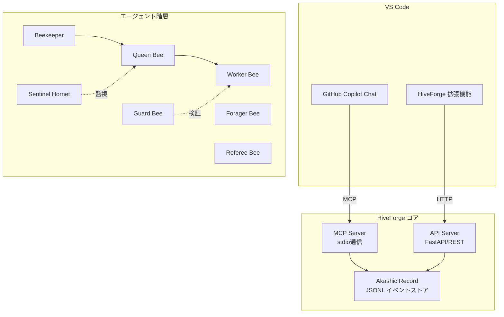

# アーキテクチャ

HiveForgeの技術アーキテクチャドキュメント。

| トピック | 説明 |
|---------|------|
| [イベント型](events.md) | イベント型リファレンスとスキーマ |
| [設定](configuration.md) | 設定ファイルリファレンス |

## システム概要



## コアコンポーネント

### Akashic Record (AR)

不変の追記専用イベントストア。

- **ストレージ**: JSONLファイル（Run毎に1ファイル）
- **整合性**: SHA-256ハッシュチェーン（各イベントが親を参照）
- **シリアライズ**: RFC 8785 (JCS — JSON Canonicalization Scheme)
- **ID**: ULID（時間順序付きユニーク識別子）

### 状態機械

厳密な有限状態機械がエンティティのライフサイクルを制御します。無効な遷移は即座に `InvalidStateTransitionError` を発生させます。

### Activity Bus

リアルタイム更新用のPub/Subイベント通知システム。

### Policy Gate

承認制御のためのActionClass × TrustLevelマトリクス。

### Lineage

任意の成果物から「なぜ」を遡及するための因果リンク追跡。

## ソースコード構造

```
src/hiveforge/
├── core/           # コアロジック（イベント、状態機械、AR）
│   ├── events/     # イベントモデル（EventType enum等）
│   ├── models/     # ドメインモデル（ActionClass等）
│   ├── ar/         # Akashic Record（永続化）
│   ├── state/      # 状態機械
│   ├── honeycomb/  # 実行履歴・学習基盤（Episode、KPI）
│   ├── swarming/   # Swarming Protocol（適応的Colony編成）
│   ├── intervention/ # 介入・エスカレーション永続化
│   ├── github/     # GitHub Projection（PR/Issue同期）
│   ├── activity_bus.py
│   ├── config.py
│   ├── lineage.py
│   ├── policy_gate.py
│   └── rate_limiter.py
├── api/            # FastAPIサーバー
├── mcp_server/     # MCPサーバー
├── beekeeper/      # Beekeeperエージェント
├── queen_bee/      # Queen Beeエージェント
├── worker_bee/     # Worker Beeエージェント
├── guard_bee/      # Guard Beeエージェント
├── forager_bee/    # Forager Beeエージェント
├── referee_bee/    # Referee Beeエージェント
├── scout_bee/      # Scout Beeエージェント
├── sentinel_hornet/ # Sentinel Hornetエージェント
├── prompts/        # プロンプト管理
├── llm/            # LLM統合
├── agent_ui/       # Agent UI MCPサーバー
├── vlm/            # VLM（画像解析）
└── cli.py          # CLIツール
```
