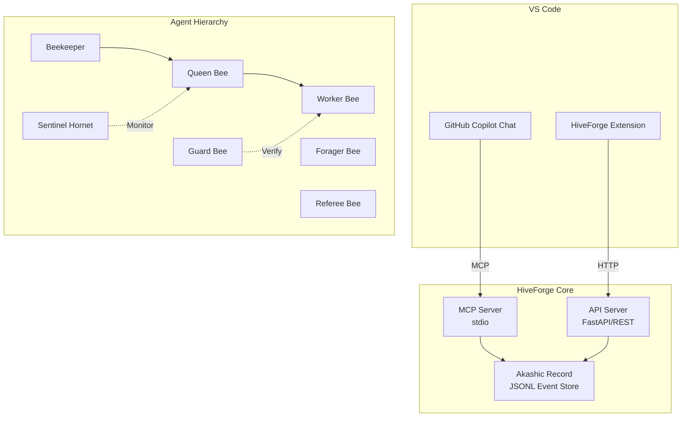

# Architecture

Technical architecture documentation for HiveForge.

| Topic | Description |
|-------|-------------|
| [Event Types](events.md) | Event type reference and schema |
| [Configuration](configuration.md) | Configuration file reference |

## System Overview



## Core Components

### Akashic Record (AR)

The immutable, append-only event store.

- **Storage**: JSONL files (one per Run)
- **Integrity**: SHA-256 hash chain (each event references its parent)
- **Serialization**: RFC 8785 (JCS — JSON Canonicalization Scheme)
- **IDs**: ULID (time-ordered unique identifiers)

### State Machine

Strict finite state machines govern entity lifecycles. Invalid transitions raise `InvalidStateTransitionError` immediately.

### Activity Bus

Pub/sub event notification system for real-time updates.

### Policy Gate

ActionClass × TrustLevel matrix for approval control.

### Lineage

Causal link tracking for tracing "why" from any artifact.

## Source Code Structure

::: hiveforge
    options:
      show_root_heading: false
      show_source: false
      members: false

```
src/hiveforge/
├── core/           # Core logic (events, state machines, AR)
│   ├── events/     # Event models (EventType enum, etc.)
│   ├── models/     # Domain models (ActionClass, etc.)
│   ├── ar/         # Akashic Record (persistence)
│   ├── state/      # State machines
│   ├── honeycomb/  # Execution history & learning (Episode, KPI)
│   ├── swarming/   # Swarming Protocol (adaptive Colony formation)
│   ├── intervention/ # Intervention & escalation persistence
│   ├── github/     # GitHub Projection (PR/Issue sync)
│   ├── activity_bus.py
│   ├── config.py
│   ├── lineage.py
│   ├── policy_gate.py
│   └── rate_limiter.py
├── api/            # FastAPI server
├── mcp_server/     # MCP Server
├── beekeeper/      # Beekeeper agent
├── queen_bee/      # Queen Bee agent
├── worker_bee/     # Worker Bee agent
├── guard_bee/      # Guard Bee agent
├── forager_bee/    # Forager Bee agent
├── referee_bee/    # Referee Bee agent
├── scout_bee/      # Scout Bee agent
├── sentinel_hornet/ # Sentinel Hornet agent
├── prompts/        # Prompt management
├── llm/            # LLM integration
├── agent_ui/       # Agent UI MCP server
├── vlm/            # VLM (image analysis)
└── cli.py          # CLI tool
```
