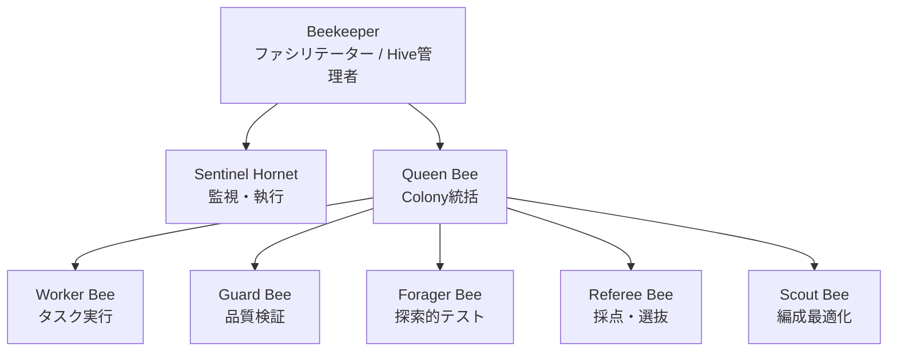

# エージェント

ColonyForgeはミツバチのコロニー組織に着想を得た階層型マルチエージェントアーキテクチャを使用します。

## エージェント階層

## エージェントの役割

### Beekeeper :material-account-tie:

**ユーザー対面のファシリテーター**であり、最上位のコーディネーター。

- ユーザーとの主対話インターフェース
- 複数のHiveを管理
- Queen Beeに作業を委任
- Queen Beeからのエスカレーションを処理

### Sentinel Hornet :material-shield-alert:

**安全監視・執行エージェント**。

- 暴走プロセス、無限ループ、コスト超過を検出
- 緊急停止をトリガー可能
- リソース消費を監視
- 作業階層から独立（他のエージェントによるオーバーライド不可）

### Queen Bee :material-crown:

**Colony統括エージェント**。

- ゴールをTaskに分解
- Colony内のWorker Beeを管理
- Conferenceを通じて他Colonyと連携
- 解決不能な問題をBeekeeperにエスカレーション

### Worker Bee :material-hammer-wrench:

**タスク実行エージェント**。

- 個々のタスクを実装（コード、テスト、ドキュメント）
- 結果をQueen Beeに報告
- LLMとツールを使用して実行

### Guard Bee :material-shield-check:

**Evidence-first品質検証エージェント**。

- L1（自動化）とL2（設計）チェックでColonyの成果物を検証
- 証拠を必要とする：diff、テスト結果、カバレッジ、lint出力
- 合格/不合格/差戻しの判定を発行

### Forager Bee :material-magnify:

**探索的テスト・影響分析エージェント**。

- 標準テストスイートを超えた探索的テストを実行
- 影響グラフを分析して意図しない副作用を検出
- 異常をReferee BeeとGuard Beeに報告

### Referee Bee :material-gavel:

**多面的採点・選抜エージェント**。

- N個の候補ソリューションを複数の次元でスコアリング
- Guard Bee検証の上位候補を選抜
- 「大量生成→自動検証→生存選抜」パラダイムを実現

### Scout Bee :material-compass:

**編成最適化エージェント**。

- タスク特性を分析して最適なColony構成を提案
- 適応的チーム編成のためのSwarming Protocolの一部
