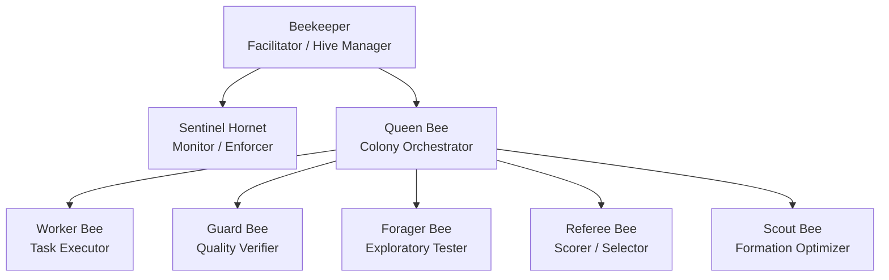

# Agents

ColonyForge uses a hierarchical multi-agent architecture inspired by bee colony organization.

## Agent Hierarchy

## Agent Roles

### Beekeeper :material-account-tie:

The **user-facing facilitator** and top-level coordinator.

- Primary interface for user interaction
- Manages multiple Hives
- Delegates work to Queen Bees
- Handles escalations from Queen Bees

### Sentinel Hornet :material-shield-alert:

The **safety monitor and enforcer**.

- Detects runaway processes, infinite loops, cost overruns
- Can trigger emergency stops
- Monitors resource consumption
- Independent from the work hierarchy (cannot be overridden by other agents)

### Queen Bee :material-crown:

The **Colony orchestrator**.

- Decomposes goals into Tasks
- Manages Worker Bees within a Colony
- Coordinates with other Colonies via Conference
- Escalates unresolvable issues to Beekeeper

### Worker Bee :material-hammer-wrench:

The **task executor**.

- Implements individual tasks (code, tests, docs)
- Reports results back to Queen Bee
- Uses LLM and tools for execution

### Guard Bee :material-shield-check:

The **evidence-first quality verifier**.

- Verifies Colony outputs using L1 (automated) and L2 (design) checks
- Requires evidence: diffs, test results, coverage, lint output
- Issues pass/fail/rework verdicts

### Forager Bee :material-magnify:

The **exploratory tester and impact analyst**.

- Runs exploratory tests beyond standard test suites
- Analyzes impact graphs to detect unintended side effects
- Reports anomalies to Referee Bee and Guard Bee

### Referee Bee :material-gavel:

The **multi-criteria scorer and selector**.

- Scores N candidate solutions on multiple dimensions
- Selects top candidates for Guard Bee verification
- Enables the "generate → verify → select" paradigm

### Scout Bee :material-compass:

The **formation optimizer**.

- Analyzes task characteristics for optimal Colony composition
- Part of the Swarming Protocol for adaptive team organization
