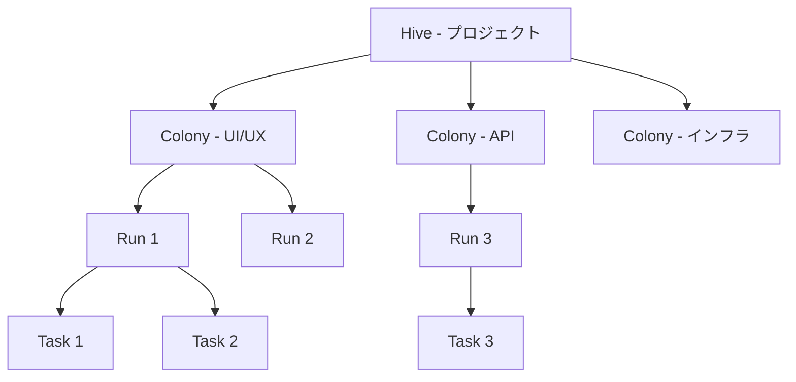
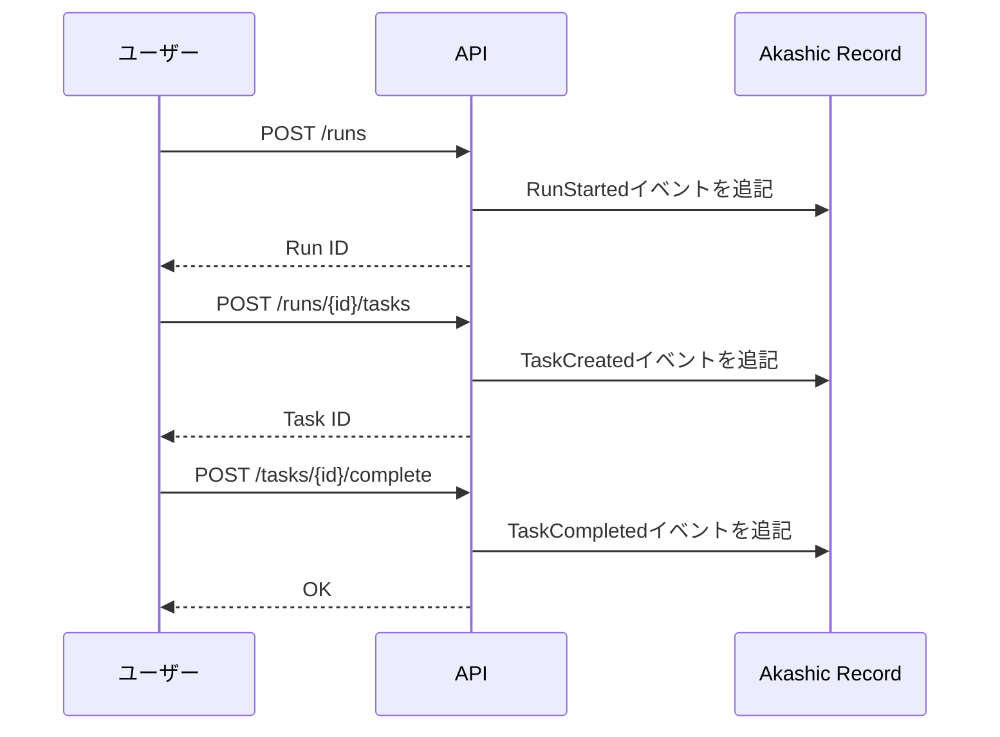
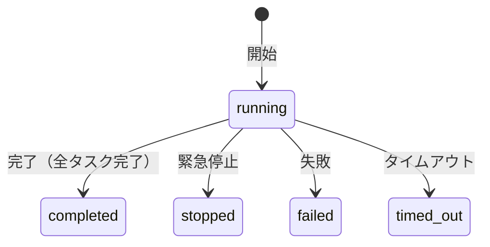
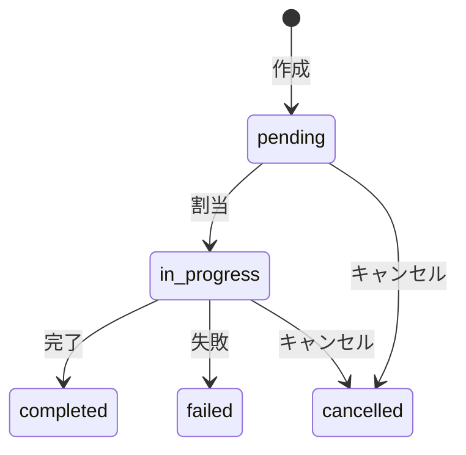
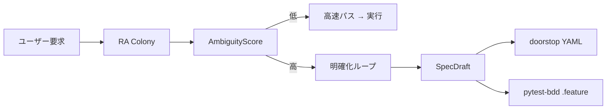

# コンセプト

## 階層モデル

ColonyForgeは4階層構造で作業を組織化します：



### Hive

**Hive**は最上位の組織単位で、プロジェクトやイニシアチブを表します。

- 複数のColonyを含む
- Beekeeperエージェントが管理
- 状態: `active` → `closed`

### Colony

**Colony**はHive内の専門作業グループで、特定のドメイン（UI、API、インフラなど）に特化します。

- 複数のRunを含む
- Queen Beeエージェントが管理
- 状態: `pending` → `active` → `completed` / `failed`

### Run

**Run**は1回の実行パスを表します。Run内の全状態変更はイベントとして記録されます。

- TaskとRequirementを含む
- 状態: `running` → `completed` / `stopped` / `failed` / `timed_out`

### Task

**Task**はRun内の原子的な作業単位です。

- 状態: `pending` → `in_progress` → `completed` / `failed` / `cancelled`
- 完了時に結果を記録

### Requirement（承認要請）

**Requirement**は続行前にユーザーの承認が必要な確認要請を表します。

- 状態: `pending` → `approved` / `rejected` / `cancelled`
- ActionClassとTrustLevelにより制御

## イベントソーシング

ColonyForgeの全状態変更は**不変イベント**としてAkashic Record (AR) に記録されます。



### イベントの構成要素

全てのイベントは以下を含みます：

| フィールド | 説明 |
|-----------|------|
| `event_id` | ユニークID（ULID — 時間順序付き） |
| `run_id` | 所属するRun |
| `event_type` | 型列挙（例: `RUN_STARTED`, `TASK_COMPLETED`） |
| `timestamp` | ISO 8601タイムスタンプ |
| `hash` | 正準JSON (JCS) のSHA-256ハッシュ |
| `parent_hash` | 前イベントのハッシュ — チェーンを形成 |

### 因果追跡（Lineage）

イベントは因果的にリンクでき、任意の成果物が「なぜ」作られたかを遡及できます。

```
TaskCompleted → リンク → TaskCreated → リンク → RunStarted
```

`GET /runs/{run_id}/events/{event_id}/lineage` で因果グラフを探索できます。

## 状態機械

各エンティティは厳密な状態機械に従います。無効な遷移は即座にエラーを発生させます（fail-fast）。

### Runの状態



### Taskの状態



## ActionClassと信頼レベル

操作はリスクレベルで分類されます：

| ActionClass | 例 | 承認 |
|-------------|-----|------|
| `SAFE` | ファイル読取、検索 | 自動承認 |
| `NORMAL` | ファイル作成、テスト実行 | 信頼レベルに依存 |
| `DANGEROUS` | ファイル削除、コマンド実行 | 承認必要 |
| `CRITICAL` | デプロイ、データ移行 | 常に承認必要 |

信頼レベル（`UNTRUSTED`、`BASIC`、`TRUSTED`、`ADMIN`）が承認閾値を決定します。

## Honeycomb（学習基盤）

HoneycombシステムはColonyのパフォーマンススナップショットである実行**エピソード**を記録し、KPIを計算します：

| KPI | 説明 |
|-----|------|
| Correctness | 失敗なしで完了したタスクの割合 |
| Guard Pass Rate | 品質検証合格率 |
| Repeatability | 複数実行間の一貫性 |
| Avg Cycle Time | 平均タスク完了時間 |
| Collaboration Score | Colony間連携の品質 |

これらのKPIは時系列のトレンド追跡により改善サイクル（PDCA）を可能にします。

## 要求分析とトレーサビリティ

ColonyForgeには**要求分析Colony（Requirement Analysis Colony）**が含まれており、実行前にユーザー要求を体系的に分析・明確化することで、性急なタスク分解を防ぎます。

### コアフロー



### 主要コンセプト

| コンセプト | 説明 |
|------------|------|
| **SpecDraft** | RA Colonyが生成する構造化された仕様草案。doorstop YAMLとして永続化 |
| **AcceptanceCriterion** | `text`, `measurable`, `metric`, `threshold` を持つ構造化受入基準 |
| **AmbiguityScore** | 要求の曖昧さを定量的に評価（0.0〜1.0） |
| **doorstop** | YAMLベースの要件管理ツール — `doorstop publish` で仕様書出力が可能 |
| **pytest-bdd** | 受入基準を `.feature` ファイルとしてエクスポートし、自動検証を実現 |

### トレーサビリティチェーン

```
ユーザー要求 → SpecDraft → doorstop YAML (REQ001.yml)
                         → pytest-bdd .feature
                         → ARイベント (ra.analysis_started, ra.spec_generated, ...)
```

全ての要件は、ユーザーの意図から仕様、そしてテスト検証まで追跡可能です。全ての状態変更は不変ARイベントとして記録されます。
