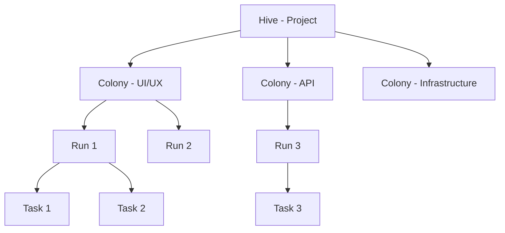
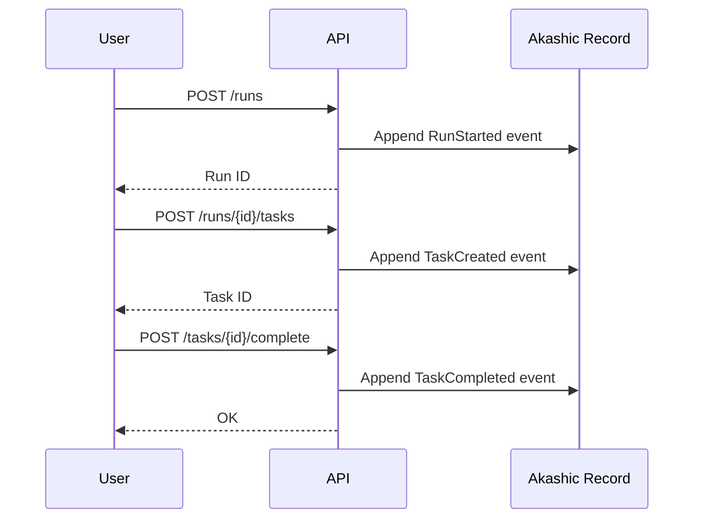
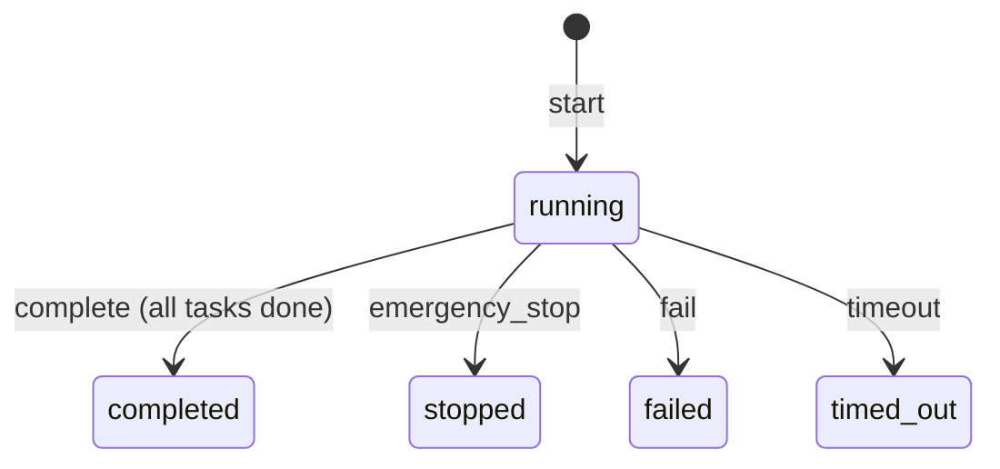
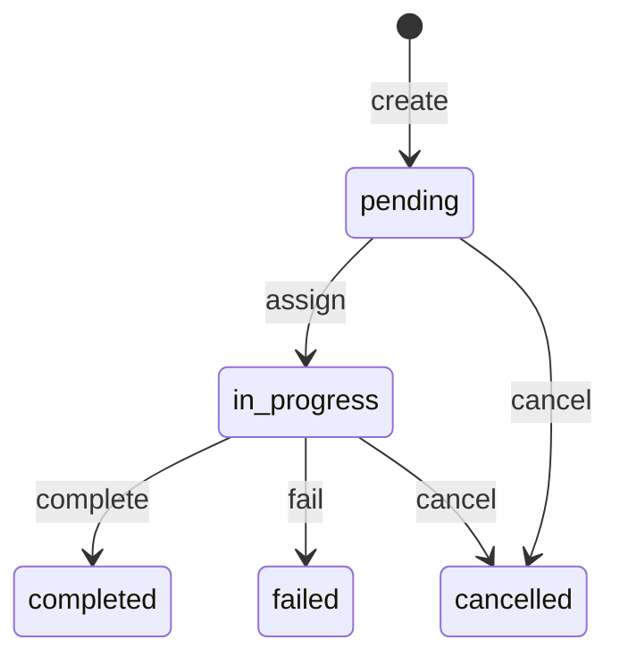
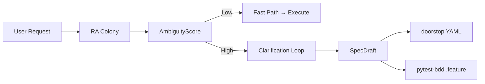

# Concepts

## Hierarchical Model

ColonyForge organizes work in a 4-level hierarchy:



### Hive

A **Hive** is the top-level organizational unit, representing a project or initiative.

- Contains multiple Colonies
- Managed by the Beekeeper agent
- States: `active` → `closed`

### Colony

A **Colony** is a specialized work group within a Hive, focused on a particular domain (e.g., UI, API, infrastructure).

- Contains multiple Runs
- Managed by the Queen Bee agent
- States: `pending` → `active` → `completed` / `failed`

### Run

A **Run** represents a single execution pass of work. All state changes within a Run are recorded as events.

- Contains Tasks and Requirements
- States: `running` → `completed` / `stopped` / `failed` / `timed_out`

### Task

A **Task** is an atomic unit of work within a Run.

- States: `pending` → `in_progress` → `completed` / `failed` / `cancelled`
- Each task records its result upon completion

### Requirement (Approval Request)

A **Requirement** represents a confirmation request that needs user approval before proceeding.

- States: `pending` → `approved` / `rejected` / `cancelled`
- Governed by ActionClass and TrustLevel

## Event Sourcing

All state changes in ColonyForge are recorded as **immutable events** in the Akashic Record (AR).



### Event Properties

Every event includes:

| Field | Description |
|-------|-------------|
| `event_id` | Unique ID (ULID — time-ordered) |
| `run_id` | Owning Run |
| `event_type` | Type enum (e.g., `RUN_STARTED`, `TASK_COMPLETED`) |
| `timestamp` | ISO 8601 timestamp |
| `hash` | SHA-256 hash of canonical JSON (JCS) |
| `parent_hash` | Previous event's hash — forms a chain |

### Causal Tracing (Lineage)

Events can be linked causally, allowing you to trace "why" any artifact was produced.

```
TaskCompleted → linked to → TaskCreated → linked to → RunStarted
```

Use `GET /runs/{run_id}/events/{event_id}/lineage` to explore the causal graph.

## State Machines

Each entity follows a strict state machine. Invalid transitions raise errors immediately (fail-fast).

### Run States



### Task States



## ActionClass and Trust Levels

Operations are classified by risk level:

| ActionClass | Examples | Approval |
|-------------|----------|----------|
| `SAFE` | Read files, search | Auto-approved |
| `NORMAL` | Create files, run tests | Based on trust level |
| `DANGEROUS` | Delete files, exec commands | Requires approval |
| `CRITICAL` | Deploy, data migration | Always requires approval |

Trust levels (`UNTRUSTED`, `BASIC`, `TRUSTED`, `ADMIN`) determine the approval threshold.

## Honeycomb (Learning)

The Honeycomb system records execution **Episodes** — snapshots of a Colony's performance — and calculates KPIs:

| KPI | Description |
|-----|-------------|
| Correctness | Tasks completed without failures |
| Guard Pass Rate | Quality verification pass rate |
| Repeatability | Consistency across multiple runs |
| Avg Cycle Time | Average task completion time |
| Collaboration Score | Cross-colony coordination quality |

These KPIs enable improvement cycles (PDCA) by tracking trends over time.

## Requirement Analysis & Traceability

ColonyForge includes a **Requirement Analysis Colony** that prevents premature task decomposition by systematically analyzing and clarifying user requirements before execution.

### Core Flow



### Key Concepts

| Concept | Description |
|---------|-------------|
| **SpecDraft** | A structured specification draft generated by the RA Colony, persisted as doorstop YAML |
| **AcceptanceCriterion** | Structured acceptance criteria with `text`, `measurable`, `metric`, `threshold` fields |
| **AmbiguityScore** | Quantitative assessment of requirement ambiguity (0.0–1.0) |
| **doorstop** | YAML-based requirement management tool — enables `doorstop publish` for specification documents |
| **pytest-bdd** | Acceptance criteria are exported as `.feature` files for automated verification |

### Traceability Chain

```
User Request → SpecDraft → doorstop YAML (REQ001.yml)
                         → pytest-bdd .feature
                         → AR Events (ra.analysis_started, ra.spec_generated, ...)
```

Every requirement is traceable from user intent through specification to test verification, with all state changes recorded as immutable AR events.
